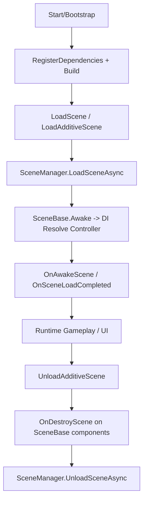

# Dignus.Unity

**Lightweight Unity extension built on top of the Dignus framework.**  
Provides dependency injection, coroutine management, pooling, and DI-ready scene architecture for scalable Unity projects.

---

## Overview

`Dignus.Unity` is a lightweight and extensible Unity framework built to streamline large-scale game architecture.  
It offers dependency injection, coroutine scheduling, resource and object pooling, and scene-based architecture with reactive data binding.

---

## Core Features

| Feature | Description |
| :--- | :--- |
| **Dependency Injection** | Lightweight DI via `DignusUnityServiceContainer` |
| **Scene Architecture** | Structured scene controllers with `SceneControllerBase<TScene, TModel>` |
| **Coroutine Manager** | High-performance coroutine scheduler using `DignusUnityCoroutineManager` |
| **Object Pooling** | Reuse `GameObject` and `Component` instances via `DignusUnityObjectPool` |
| **Resource Management** | Centralized prefab and asset handling with `DignusUnityResourceManager` |
| **Reactive Binding** | `BindableProperty<T>` system for UI and gameplay data synchronization |
| **Singleton System** | Simple and persistent lifecycle management for runtime managers |
| **Async Scene Flow** | `DignusUnitySceneManager` for async scene transitions and initialization |

---

## Architecture Overview

`Dignus.Unity` works in this order:

1. `DignusUnityServiceContainer` builds the DI container at application startup.
2. Each scene splits responsibilities using `SceneBase` + `SceneControllerBase<TScene, TModel>` + `ISceneModel`.
3. `DignusUnitySceneManager` serializes scene load/unload through queue processing.
4. On scene transition, DI and `SceneBase` lifecycle wiring bind controller and model together.
5. Shared infrastructure is handled by `DignusUnityCoroutineManager`, `DignusUnityResourceManager`, and `DignusUnityObjectPool`.



## Scene lifecycle at a glance

- Single scene load: Unload previous scene flow and load the new single scene, then update `CurrentScene`.
- Additive load: Keep existing scenes and load an additional scene.
- Additive unload: Cleanup scene components through `OnDestroyScene()` and unload the scene.  
  (No completion callback; lifecycle-based completion)
- Exception: `InvalidOperationException` is thrown if `UnloadAdditiveScene` is called for the current or active single scene.

### SceneBase practical patterns

When controller binding is manual (like a title scene):

```csharp
public class TitleScene : SceneBase
{
    private TitleSceneController _titleSceneController;

    public override void OnDestroyScene()
    {
        _titleSceneController.Dispose();
    }

    protected override void OnAwakeScene()
    {
        _titleSceneController = DignusUnityServiceContainer.GetService<TitleSceneController>();
        _titleSceneController.BindScene(this);
        _titleSceneController.InitializeLocalSession();
    }
}
```

For most scenes, `SceneBase<TController>` handles binding automatically:

```csharp
internal class GameScene : SceneBase<GameSceneController>
{
    [SerializeField] private GameWorld _gameWorld;
    private AtlasManager _atlasManager;
    private GameSceneUI _gameUI;

    protected override void OnAwakeScene()
    {
        if (_gameWorld == null)
        {
            throw new InvalidOperationException("GameScene requires a GameWorld.");
        }

        _atlasManager = DignusUnityServiceContainer.GetService<AtlasManager>();
        _atlasManager.Load(SceneType.GameScene);
        _gameWorld.Init(_atlasManager);

        SceneController.Init(_gameWorld);
        _gameUI = UIManager.Instance.AddUI<GameSceneUI>();
        _gameUI.Init(SceneController.Model, SceneController);
    }

    public override void OnDestroyScene()
    {
        _gameUI?.DisposeUI();
        SceneController.Dispose();
        _gameWorld?.Dispose();
        _atlasManager?.Unload();
        _atlasManager = null;
    }
}
```

The pattern is the same: initialize dependencies/data in `OnAwakeScene`,
then perform scene-scoped cleanup in `OnDestroyScene`.

Important: Configure the DI container once in `ApplicationManager`, and use `GetService()` inside scene entry only.

## Basic Usage

### 1. Add packages and mark dependencies

1. Add `Dignus` and `Dignus.Unity` dependencies to your Unity C# project.
2. Mark scene controllers/services with `[Injectable]`.
3. Prefer one constructor for each injectable class, or mark your constructor with `[InjectConstructor]`.

```csharp
using Dignus.DependencyInjection.Attributes;
using Dignus.Unity.Framework;

[Injectable(LifeScope.Singleton)]
public class LobbySceneController : SceneControllerBase<LobbyScene, LobbySceneModel>
{
    private readonly GameClientService _gameClientService;
    private readonly UserService _userService;

    public LobbySceneController(GameClientService gameClientService, UserService userService)
    {
        _gameClientService = gameClientService;
        _userService = userService;
    }
}
```

### 2. Register dependencies at startup

DI should be initialized once in app startup bootstrap (`ApplicationManager`, etc.) with a single call.  
In practice, call `Init()` at entry and then use `GetService()` / `SceneBase<T>` directly in scenes.

```csharp
using DataContainer.Generated;
using Dignus.Unity;
using Dignus.Unity.DependencyInjection;
using UnityEngine;

namespace Assets.Scripts.Internals
{
    internal class ApplicationManager : SingletonMonoBehaviour<ApplicationManager>
    {
        private bool _isInit = false;

        public void Init()
        {
            if (_isInit == true)
            {
                return;
            }
            _isInit = true;

            // register all dependencies used by game code
            var container = DignusUnityServiceContainer.RegisterDependencies(GetType().Assembly);
            container.Build();
        }
    }
}
```

```csharp
public class GameBootstrap : MonoBehaviour
{
    private void Awake()
    {
        ApplicationManager.Instance.Init();
    }
}
```

```csharp
// optional: load first scene after bootstrap
public class BootSceneLoader : MonoBehaviour
{
    private void Start()
    {
        DignusUnitySceneManager.Instance.LoadScene(SceneType.TitleScene);
    }
}
```

### 3. Resolve scene controller automatically in `SceneBase`

`SceneBase<TController>` uses `DignusUnityServiceContainer.GetService<TController>()` during `Awake()` and binds itself.

```csharp
public class LobbyScene : SceneBase<LobbySceneController>
{
    protected override void OnAwakeScene()
    {
        SceneController.OnAwake();
    }

    public override void OnDestroyScene()
    {
        SceneController.Dispose();
    }
}
```

### 4. Pass scene components as runtime arguments

If a scene needs Unity components injected into controller constructor:

```csharp
public class LobbySceneController : SceneControllerBase<LobbyScene, LobbySceneModel>
{
    private readonly LobbyUI _lobbyUI;

    public LobbySceneController(LobbyUI lobbyUI, GameClientService gameClientService)
    {
        _lobbyUI = lobbyUI;
        _gameClientService = gameClientService;
    }
}
```

```csharp
public class LobbyScene : SceneBase<LobbySceneController>
{
    public LobbyUI LobbyUI;
    protected override void OnAwakeScene()
    {
        // InjectedComponents are matched by type to constructor parameters
        // before DI container fallback.
        SceneController.OnAwake();
    }
}
```

```csharp
// or set the array at runtime
public override void OnAwakeScene()
{
    InjectedComponents = new MonoBehaviour[] { LobbyUI };
}
```


### 6. Model bindable property usage

Use `BindableProperty<T>` in `ISceneModel` to expose UI-bound values and subscribe to changes from scene/UI logic.

```csharp
using Dignus.Unity.Binding;

public class LobbySceneModel : ISceneModel
{
    public BindableProperty<int> Gold { get; } = new BindableProperty<int>(0);
    public BindableProperty<string> StatusMessage { get; } = new BindableProperty<string>(string.Empty);
}
```

```csharp
// SceneController
Model.Gold.Value += 100;
Model.StatusMessage.Value = "Ready";
```

```csharp
// Scene or UI class
private void OnEnable()
{
    SceneController.Model.Gold.ValueChanged += OnGoldChanged;
}

private void OnDisable()
{
    SceneController.Model.Gold.ValueChanged -= OnGoldChanged;
}

private void OnGoldChanged(int value)
{
    _goldText.text = value.ToString();
}
```

`BindableProperty<T>` supports automatic binding semantics through event hooks, and because `Value` is a property you can also use it directly when needed.
### 5. UnityServiceContainer quick reference

```csharp
var controller = DignusUnityServiceContainer.GetService<LobbySceneController>();
var controllerWithComponents = DignusUnityServiceContainer.GetService<LobbySceneController>(lobbyUI, optionalServiceLocator);
```

---

## Manager Overview

### DignusUnityCoroutineManager
```csharp
DignusUnityCoroutineManager.Start(MyCoroutine());
```

Efficient coroutine handler that executes enumerators or coroutine handles with optional delay and completion callbacks.
Internally updates via FixedUpdate to ensure stable timing without GC allocations.

### DignusUnityObjectPool
```csharp
var bullet = DignusUnityObjectPool.Instance.Pop(prefab);
DignusUnityObjectPool.Instance.Push(bullet);
```

Reuses and manages pooled GameObject instances to minimize runtime allocations.
Supports both GameObject and Component-based access.

### DignusUnityResourceManager
```csharp
var prefab = DignusUnityResourceManager.Instance.LoadAsset<MyPrefab>();
```

Loads assets from Unity’s Resources folder with internal caching and prefab-path attribute support.

### DignusUnitySceneManager
```csharp
// single scene
DignusUnitySceneManager.Instance.LoadScene(SceneType.LobbyScene);

// additive scene load
DignusUnitySceneManager.Instance.LoadAdditiveScene(SceneType.HUD);
```

```csharp
// unload an additive scene when it is no longer needed
DignusUnitySceneManager.Instance.UnloadAdditiveScene(SceneType.HUD);
```

`UnloadAdditiveScene(...)` is an additive-scene-only API.  
Cleanup is done through scene lifecycle (`OnDestroyScene()`), so **no completion callback is supported**.  
Calling it on the current/active single scene throws `InvalidOperationException`.

### UnityServiceContainer
```csharp
// RegisterDependencies() and Build() are called once in bootstrap, not per scene
// var container = DignusUnityServiceContainer.RegisterDependencies(...);
// container.Build();
```

Dependency injection container specialized for Unity — supports runtime object construction with argument injection.

---

## Unity Package Manager Installation (GitHub URL)

Use this when installing directly from a GitHub repository.

| Target | Value |
| :--- | :--- |
| Manifest field | `Packages/manifest.json` → `"dependencies"` |
| Source format | Git URL (optionally with branch, tag, commit, or `path` for subfolder) |

```json
{
  "dependencies": {
    "com.dignus.unity": "https://github.com/EomTaeWook/Dignus.Unity.git#v1.1.2"
  }
}
```

If you use this folder as the repository root for the package, install with:

```json
{
  "dependencies": {
    "com.dignus.unity": "https://github.com/EomTaeWook/Dignus.Unity.git#v1.1.2"
  }
}
```

For this repository, the minimum UPM-ready structure is currently:

```text
publish/upm/com.dignus.unity/
  package.json
  README.md
  LICENSE
  Icon.jpg
  Runtime/
    Dignus.Unity.dll
    Dignus.dll
```

---

## Example: Lobby Scene Architecture
### Controller
```csharp
[Injectable(LifeScope.Singleton)]
public class LobbySceneController : SceneControllerBase<LobbyScene, LobbySceneModel>
{
    private readonly GameClientService _gameClientService;
    private readonly UserService _userService;

    public LobbySceneController(GameClientService gameClientService, UserService userService)
    {
        _userService = userService;
        _gameClientService = gameClientService;
    }

    public void OnAwake()
    {
        Model.CurrentPlayer = new GamePlayer()
        {
            AccountId = _userService.GetUserModel().AccountId,
            Nickname = _userService.GetUserModel().Nickname
        };
    }

    public void RoomListRequest(int page, int size)
    {
        _gameClientService.Send(Packet.MakePacket(CGSProtocol.GetRoomList, new GetRoomList()
        {
            Page = page,
            ItemSize = size
        }));
    }

    public override void Dispose()
    {
        Model.LobbyRoomInfos.Clear();
    }
}
```

### Model
```csharp
public class LobbySceneModel : ISceneModel
{
    public Dictionary<int, ArrayQueue<RoomListItemUI>> LobbyRoomInfos { get; set; } = new();
    public GamePlayer CurrentPlayer { get; set; }
    public List<PlayerModel> RoomMembers { get; set; }
    public int JoinRoomNumber { get; set; }
}
```

### Scene
```csharp
public class LobbyScene : SceneBase<LobbySceneController>
{
    private LobbyUI _lobbyUI;

    protected override void OnAwakeScene()
    {
        SceneController.OnAwake();
        _lobbyUI = UIManager.Instance.AddUI<LobbyUI>();
        _lobbyUI.Init(SceneController);
    }

    public override void OnDestroyScene()
    {
        UIManager.Instance.RemoveUI(_lobbyUI);
        SceneController.Dispose();
    }
}
```


### Example Scene Flow
```csharp
// Load Scene with DI Controller
DignusUnitySceneManager.Instance.LoadScene(SceneType.LobbyScene);

```

### Highlights

Zero-GC Scene Flow – Optimized for stable runtime performance

Reactive UI – BindableProperty updates UI automatically

Extensible Architecture – Seamlessly integrates with Dignus.Core and Dignus.DependencyInjection

Unity-Native Lifecycle – Works directly with Awake, Start, and OnDestroy

Production Ready – Designed for scalability and maintainability


